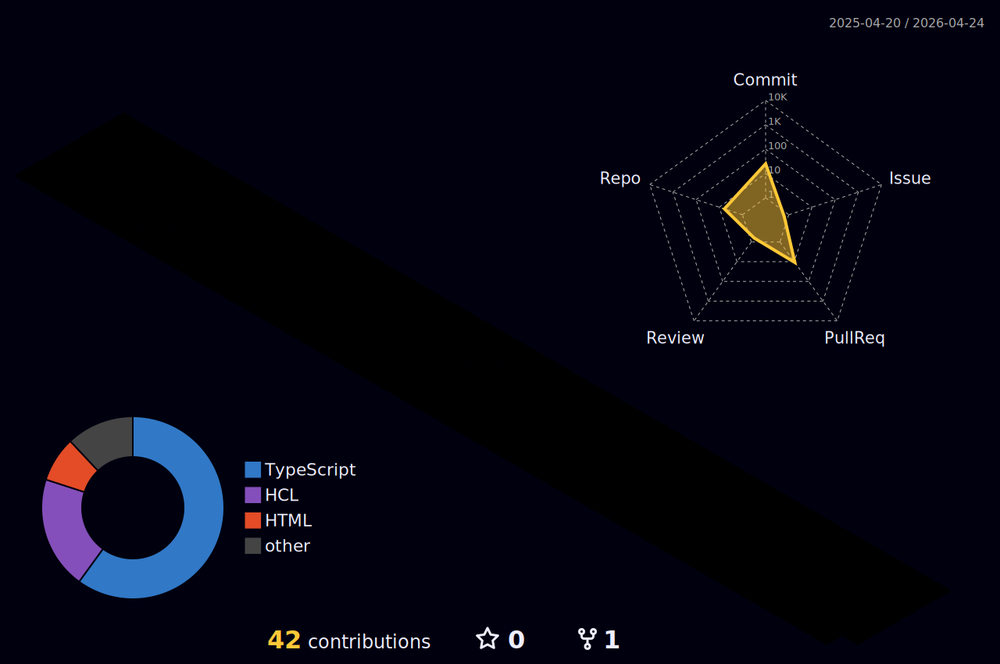

<h1>Franco Alejandro Nuñez</h1>

<h3>DEVOPS ENGINEER</h3>

### Technologies

    
    
    
    
     
    
    
    
    
    
    
    
    
    
 

### Hey there! 😁

I'm Franco Nuñez, a 24-year-old Devops Engineer based in Buenos Aires, Argentina 🇦🇷. Passionate about technology and always looking for new challenges.

    
### Contact me

 

  
  

    

 
 
 

