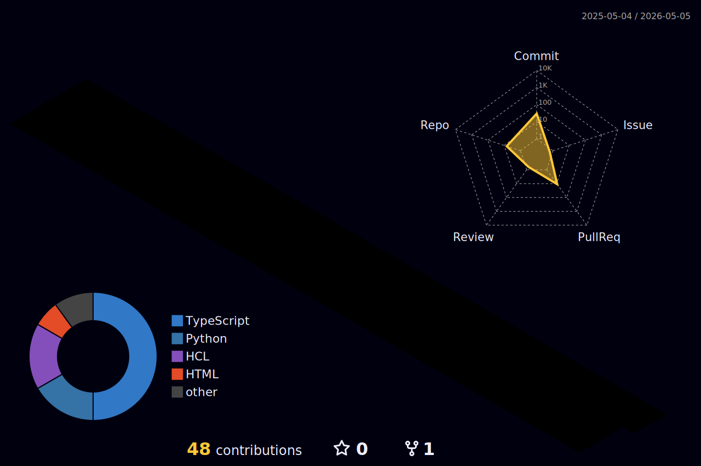

<div align="center">

# Franco Alejandro Nuñez
### 🛠️ DevOps Engineer · Cloud Architect

[](https://www.linkedin.com/in/franco954/)
[](https://francoalejandronunez.netlify.app/)
[](mailto:nunezfrancoalejandro1@gmail.com)
[](https://www.credly.com/badges/48bf25e0-250e-4945-a689-ebb3550ddcde/linked_in?t=ss00bq)

</div>

---

## 👨‍💻 Sobre mí

Hola! Soy **Franco**, DevOps Engineer con **5 años de experiencia** en la industria IT, vivo en **Buenos Aires, Argentina 🇦🇷**.

Certificado en **AWS Cloud Practitioner**, con foco en diseño y gestión de infraestructura escalable y segura. Me apasiona la automatización y mejorar la resiliencia de sistemas productivos.

Cuento además con base sólida como **Fullstack Developer (MERN)**, lo que me permite entender el ciclo de vida completo del software y colaborar de forma efectiva con equipos de desarrollo.

---

## 🚀 Stack & Tecnologías

### ☁️ Cloud & DevOps
<p>
  
  
  
  
  
  
  
</p>

### 🌐 Desarrollo Web
<p>
  
  
  
  
  
  
  
</p>

### 🗄️ Bases de Datos & Herramientas
<p>
  
  
  
  
  
  
</p>

---

## 🎯 Especialidades

```yaml
DevOps:
  CI/CD:         Azure DevOps · GitHub Actions · Jenkins
  IaC:           Terraform
  Contenedores:  Docker · Kubernetes
  Cloud:         Amazon Web Services (AWS Certified)

Fullstack:
  Frontend:      React · Next.js · TypeScript · Bootstrap
  Backend:       Node.js · Express · NestJS
  Bases datos:   MongoDB · MySQL
```

---

## 📊 GitHub Stats

<div align="center">


</div>

---

## 🏆 Certificaciones

- ☁️ **[AWS Certified Cloud Practitioner](https://www.credly.com/badges/48bf25e0-250e-4945-a689-ebb3550ddcde/linked_in?t=ss00bq)** — Amazon Web Services

---

## 📬 Contacto

<p>
  📧 <a href="mailto:nunezfrancoalejandro1@gmail.com">nunezfrancoalejandro1@gmail.com</a><br/>
  📞 +54 11 2878-0357<br/>
  🌐 <a href="https://francoalejandronunez.netlify.app/">francoalejandronunez.netlify.app</a><br/>
  📍 Buenos Aires, Argentina 🇦🇷
</p>

---

<div align="center">


*¡Siempre abierto a nuevas oportunidades y colaboraciones!*

</div>


